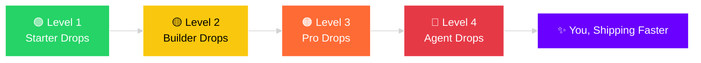

<!-- Animated Header Banner -->

<!-- Typing animated tagline -->

 

<!-- Badges -->

  
  
  
  

<!-- Join Channel Button -->

 

---

## 👋 About This Channel

**mughal.dev** is a free-resource hub built for developers, designers & vibe-coders.
No paywalls. No premium tiers. No "buy now" buttons.
Everything we drop is **100% free — always.**

<table align="center">
<tr>
<td align="center" width="200">💵</td>
<td><b>Price</b></td>
<td><code>$0.00</code></td>
</tr>
<tr>
<td align="center">🧾</td>
<td><b>Fees</b></td>
<td><code>0%</code></td>
</tr>
<tr>
<td align="center">🔓</td>
<td><b>Access</b></td>
<td><code>Open to everyone</code></td>
</tr>
<tr>
<td align="center">📦</td>
<td><b>Updates</b></td>
<td><code>New drops regularly</code></td>
</tr>
</table>

---

## 🎁 What You'll Get

| 💻 Source Codes | 🌐 WordPress | 🧩 Plugins | 🎨 UI Components |
|:---:|:---:|:---:|:---:|
| Full project codebases | Premium-style themes | Ready-to-use plugins | Buttons, cards, navbars & more |

| 🤖 AI Skills | 🧠 Vibe Coding | ✍️ Prompts | ⚡ Tech Assets |
|:---:|:---:|:---:|:---:|
| Claude / GPT skill packs | Workflows & mindset guides | Ready-made AI prompts | Icons, fonts, assets & tools |

| 🧭 AI Coding Agents | 🧱 Chrome Extensions | ⚙️ Electron Apps | 📦 npm Packages |
|:---:|:---:|:---:|:---:|
| Agent workflows & configs | Browser extension boilerplates | Desktop app starters | Ready-made AI/dev packages |

---

## 🛠️ Tech We Cover

**Frontend & Frameworks**

  

**Backend, Data & Cloud**

  

**AI, Tools & DevOps**

 

### 🤖 AI Coding Agents & Assistants We Explore

### 🧩 Chrome Extensions & Desktop

---

## 🕒 Drop Timeline

<table align="center">
<tr><td width="60" align="center">🟢</td><td><b>Level 1 — Starter Drops</b></td><td>UI components, icon packs, free prompts</td></tr>
<tr><td align="center">🟡</td><td><b>Level 2 — Builder Drops</b></td><td>WordPress themes, plugins, npm packages</td></tr>
<tr><td align="center">🟠</td><td><b>Level 3 — Pro Drops</b></td><td>Full source codes, chrome extensions, electron apps</td></tr>
<tr><td align="center">🔴</td><td><b>Level 4 — Agent Drops</b></td><td>AI skills, agent workflows, vibe-coding blueprints</td></tr>
</table>

---

## 🐍 Contribution Snake

  

> ⚙️ **Setup note:** replace `YOUR_GITHUB_USERNAME` above with your real GitHub username, and set up the
> [`contribution-cal-snake`](https://github.com/marketplace/actions/contribution-cal-snake) action (or `Platane/snk`)
> in your **profile repo** (`.github/workflows/snake.yml`) so the animation regenerates automatically on your contribution graph.

---

## 📊 Channel Stats

---

## 🚀 How It Works

---

## 💬 Community & Support

Got a request? Want a specific template, plugin, or AI prompt pack?
Drop it in the channel — we build what the community needs.

---

## 📲 Join The Channel

### ✨ Join for more exclusive drops:

# 👉 [Join mughal.dev on WhatsApp](https://whatsapp.com/channel/0029VbBUVv35fM5eAnXw3w2D)

**Free forever. No signup. No spam. Just drops. 🔥**

---

### ⭐ If this repo helped you, consider starring it!

**Made with 💻 + ☕ by mughal.dev — Free forever, for everyone.**

